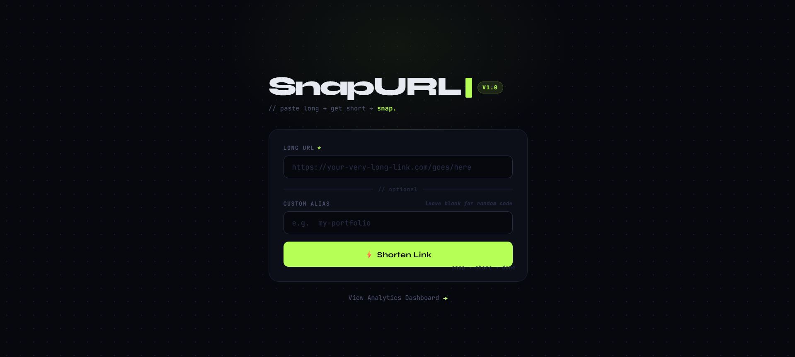
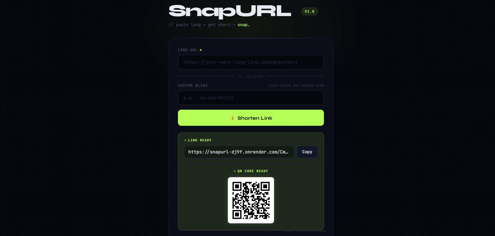
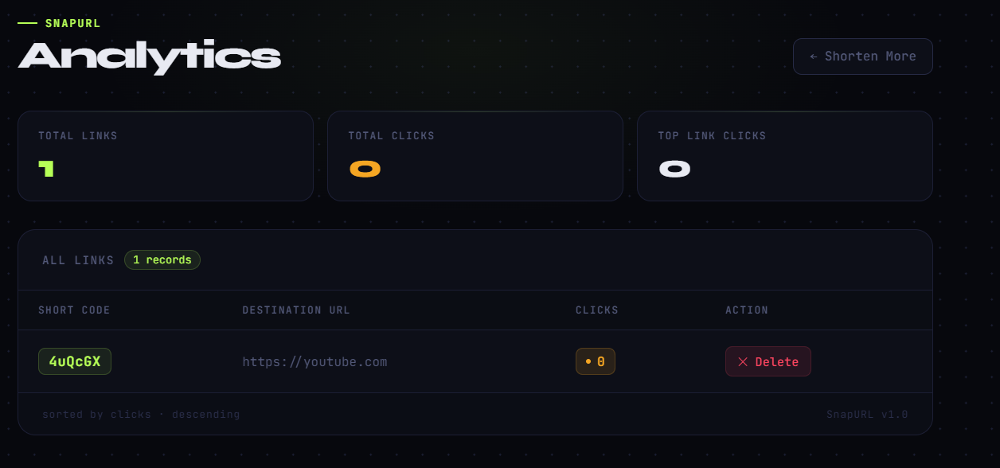

# SnapURL 🔗

A clean, fast URL shortener built with Flask and SQLite — shorten long links, create custom aliases, generate QR codes instantly, and track click analytics on a live dashboard.

**🔗 Live Demo:** [snapurl-dj9f.onrender.com](https://snapurl-dj9f.onrender.com)

> Note: hosted on a free instance, so it may take ~50 seconds to wake up if it's been inactive.

---

## ✨ Features

- 🔗 Shorten any long URL instantly
- ✏️ Create a custom alias (e.g. `/my-portfolio`) instead of a random code
- 📱 Auto-generated QR code for every shortened link
- 📊 Analytics dashboard — total links, total clicks, top performing link
- 🗑️ Delete any link directly from the dashboard
- 📋 One-click copy for the shortened URL

---

## 🖼️ Screenshots

**Homepage**


**Shortened Link + QR Code**


**Analytics Dashboard**


---

## 🛠️ Tech Stack

| Layer | Technology |
|---|---|
| Backend | Python, Flask |
| Database | SQLite |
| Frontend | HTML, CSS, JavaScript (Jinja2 templating) |
| QR Codes | `qrcode` Python library |
| Deployment | Render |

---

## 📁 Project Structure

```
URL_shortner/
├── app.py              # Main Flask app — routes & logic
├── database.py         # SQLite database functions
├── utils.py             # Short code generator
├── wsgi.py              # Production entry point for deployment
├── requirements.txt     # Python dependencies
├── templates/
│   ├── index.html        # Homepage / shorten form
│   └── analytics.html    # Analytics dashboard
├── static/
│   └── favicon.svg       # Browser tab icon
└── urls.db               # SQLite database (auto-created)
```

---

## 🚀 Run Locally

```bash
# Clone the repo
git clone https://github.com/harshit1178/URL_shortner.git
cd URL_shortner

# Create and activate a virtual environment
python -m venv venv
venv\Scripts\activate        # Windows
source venv/bin/activate     # Mac/Linux

# Install dependencies
pip install -r requirements.txt

# Run the app
python app.py
```

Then open `http://127.0.0.1:5000` in your browser.

---

## 🧠 How It Works

1. User pastes a long URL (and optionally a custom alias)
2. Flask generates a random 6-character short code (or uses the custom alias)
3. The mapping is saved in a SQLite database
4. A QR code is generated for the new short link
5. Visiting the short URL looks up the original link and redirects instantly, while incrementing its click count

---

## 🔮 Possible Future Additions

- Link expiry (auto-disable after X days)
- Password-protected links
- Click timestamps with a time-based graph
- User accounts for managing personal links

---

## 👤 Author

**Harshit Mehta**
[GitHub](https://github.com/harshit1178)


